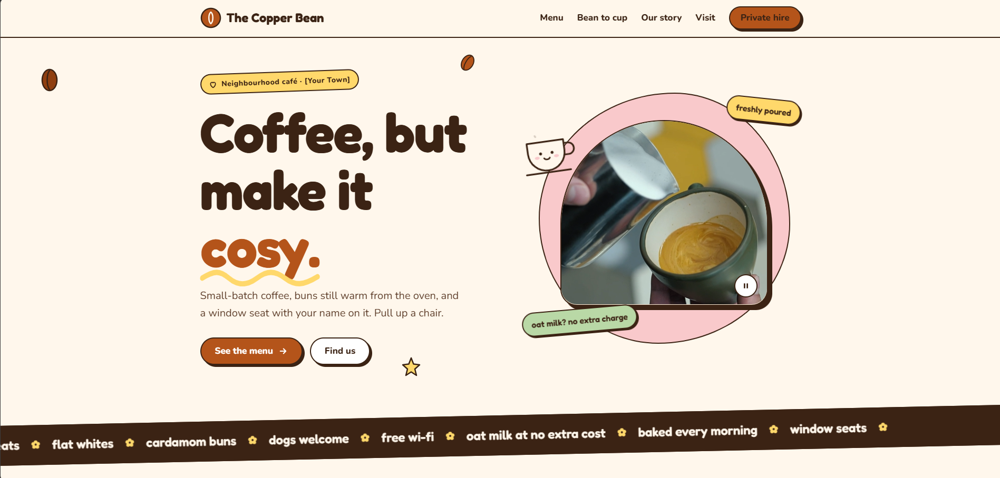

# The Copper Bean: café website

A single-page website for a fictional neighbourhood café, built with plain HTML, CSS and JavaScript.

**Live site:** https://ashwinashraf.github.io/copper-bean-cafe/



## Features

- **Playful, responsive design** using Fredoka and Nunito, with a pastel palette and a sticker-style look. The layout works from small phones to large desktops.
- **Hero video** with a pause/play button, plus two more videos that only load when scrolled into view and pause when off-screen.
- **Tabbed menu** (Coffee / Bakes & brunch) with full keyboard support: arrow keys, Home and End.
- **Live opening hours**, showing an "Open now" badge and highlighting today's hours.
- **Private hire enquiry form** with validation as you type, an error summary that links to each problem field, and an accessible confirmation message.
- **Scroll animations** built with GSAP and ScrollTrigger: headline reveal, parallax decorations, card entrances and a progress line.
- **Mobile navigation** with a hamburger menu that closes on link tap or Escape.

## Accessibility

- Semantic HTML landmarks, a skip link and visible focus outlines.
- All animation and autoplaying video is switched off when the visitor has reduced motion turned on.
- Content stays fully visible if JavaScript or the animation library fails to load.
- Form fields have proper labels, inline error messages and `aria-invalid` states.
- Touch targets are at least 44px.

## Project structure

```
copper-bean-cafe/
├── index.html      Page markup
├── css/
│   └── styles.css  All styles
├── js/
│   └── main.js     Menu, video, tabs, opening hours, form validation and animations
└── docs/
    └── screenshot.png
```

## Running locally

There's no build step. Open `index.html` in a browser, or serve the folder:

```bash
npx serve .
```

## Credits

- Photos: [Unsplash](https://unsplash.com) (Unsplash License)
- Videos: [Mixkit](https://mixkit.co) (Mixkit Free License)
- Animation: [GSAP](https://gsap.com)
- Fonts: [Google Fonts](https://fonts.google.com), Fredoka and Nunito

The café, its prices and its contact details are fictional.
